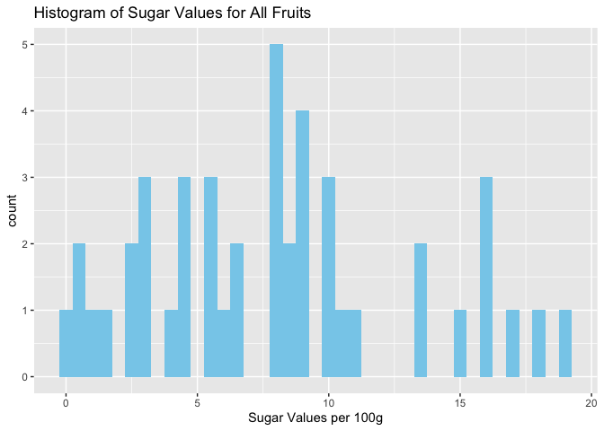
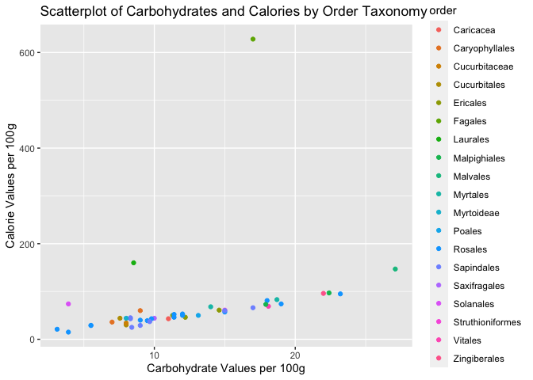
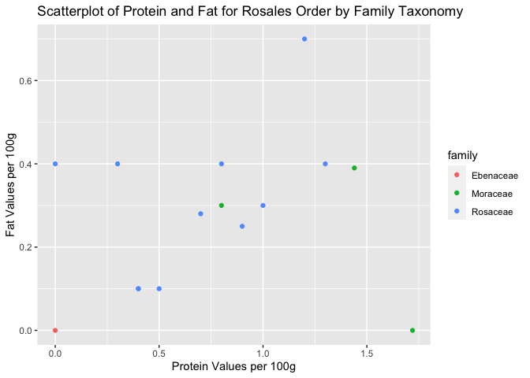
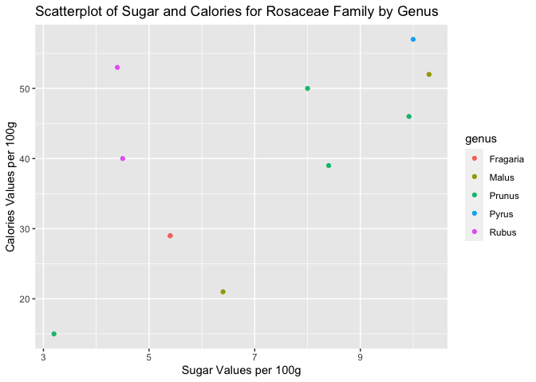

we
================
Karthik Edupuganti
2023-10-10

# Introduction

The document is a vignette that will show how to read and summarize data
from an API. More specifically, the [Fruityvice
API](%22https://www.fruityvice.com/doc/index.html). The API has only a
limited number of data which is 45 observations corresponding to 45
different fruits, along with their different nutrition values per 100g,
so there are some limitations in terms of analysis. There are few
endpoints in which we can access the API, and we will go through a
couple of them and how to access them using functions.

# Required Packages

The following packages are listed below for the creation of this
vignette.

- `jsonlite`: Allows for interaction with API and storing into a
  dataframe.
- `tidyverse`: Tons of function and features for data manipulation and
  visualization
- `ggcorrplot`: Usage for visualizing correlation matrix as a plot.

# API Functions

I will be defining the functions that can be used to pull data from
different endpoints of the Fruityvice API.

## `fruits_full()`

This function interacts with the overall fruityvice API and returns a
tibble of all fruits in API. Additionally, the function will be the
skeleton for all the other functions in this vignette. This function has
no additional parameters.

``` r
fruits_full <- function() {
    
#Interacting with API and storing data into dataframe.
dataframe <- fromJSON("https://www.fruityvice.com/api/fruit/all")
  
#Extracting variables from nested dataframe variable "Nutritions"
nutrition_variables <- dataframe$nutritions

#Extract and convert the variables from the nested dataframe
dataframe$calories <- nutrition_variables$calories
dataframe$fat <- nutrition_variables$fat
dataframe$sugar <- nutrition_variables$sugar
dataframe$carbohydrates <- nutrition_variables$carbohydrates
dataframe$protein <- nutrition_variables$protein


#Remove the original nested variable
dataframe$nutritions <- NULL


return(as_tibble(dataframe))
}
```

## `fruits_by_family()`

The function interacts with the “family” endpoint in the fruityvice API.
Family is a taxonomic classification in which organisms are classified.
It takes a parameter called family_name and return a dataframe by
whatever family is chosen in parameter. Default parameter value is
Rosaceae.

``` r
fruits_by_family <- function(family_name = "Rosaceae") {

#Creating base url
url_base <- "https://www.fruityvice.com/api/fruit/family/"

#Combining base url with defined parameter of family name and storing data into dataframe.
dataframe <- fromJSON(paste0(url_base, family_name))


#Extracting variables from nested dataframe variable "Nutritions"
nutrition_variables <- dataframe$nutritions

# Extract and convert the variables from the nested dataframe
dataframe$calories <- nutrition_variables$calories
dataframe$fat <- nutrition_variables$fat
dataframe$sugar <- nutrition_variables$sugar
dataframe$carbohydrates <- nutrition_variables$carbohydrates
dataframe$protein <- nutrition_variables$protein


# Remove the original nested variable
dataframe$nutritions <- NULL


return(as_tibble(dataframe))
}
```

## `fruits_by_order()`

The function interacts with the “order” endpoint in the fruityvice API.
Order is a taxonomic classification in which organisms are classified.
It takes a parameter called order_name and return a dataframe by
whatever order is chosen in parameter. Default parameter value is
Rosales.

``` r
fruits_by_order <- function(order_name = "Rosales") {
    
#Creating base url
url_base <- "https://www.fruityvice.com/api/fruit/order/"

#Combining base url with defined parameter of order name and storing data into dataframe.
dataframe <- fromJSON(paste0(url_base, order_name))


#Extracting variables from nested dataframe variable "Nutritions"
nutrition_variables <- dataframe$nutritions

# Extract and convert the variables from the nested dataframe
dataframe$calories <- nutrition_variables$calories
dataframe$fat <- nutrition_variables$fat
dataframe$sugar <- nutrition_variables$sugar
dataframe$carbohydrates <- nutrition_variables$carbohydrates
dataframe$protein <- nutrition_variables$protein


# Remove the original nested variable
dataframe$nutritions <- NULL


return(as_tibble(dataframe))
}
```

## `fruits_by_nutrition_value()`

The function interacts with the “nutrition value” endpoint in the
fruityvice API. This function will take in 3 parameters, the name of the
nutrition value, minimum amount of that nutrition value, and maximum
amount of that nutrition value. This function will return a dataframe
with fruits for specific nutrition value between certain range of values
defined. The default parameter values are calories and between range of
0 and 50 calories.

``` r
fruits_by_nutrition_value <- function(nutrition_name = "calories", min = 0 , max = 50) {
    
#Creating base url
url_base <- "https://www.fruityvice.com/api/fruit/"

#Combining base url with other parameters and storing data into dataframe.
dataframe <- fromJSON(paste0(url_base,nutrition_name, "?min=", min, "&max=", max))


#Extracting variables from nested dataframe variable "Nutritions"
nutrition_variables <- dataframe$nutritions

# Extract and convert the variables from the nested dataframe
dataframe$calories <- nutrition_variables$calories
dataframe$fat <- nutrition_variables$fat
dataframe$sugar <- nutrition_variables$sugar
dataframe$carbohydrates <- nutrition_variables$carbohydrates
dataframe$protein <- nutrition_variables$protein


# Remove the original nested variable
dataframe$nutritions <- NULL


return(as_tibble(dataframe))
}
```

# Exploratory Data Analysis

Now that we have the different endpoints to call the data from the API.
Lets do some data exploration. Lets take a look at the overall data on
fruits by calling the fruits_function() and storing the dataframe into
an object called fruit_data_full.

``` r
fruit_data_full <- fruits_full()
fruit_data_full
```

    ## # A tibble: 45 × 10
    ##    name           id family        order         genus calories   fat sugar carbohydrates protein
    ##    <chr>       <int> <chr>         <chr>         <chr>    <int> <dbl> <dbl>         <dbl>   <dbl>
    ##  1 Persimmon      52 Ebenaceae     Rosales       Dios…       81  0    18             18      0   
    ##  2 Strawberry      3 Rosaceae      Rosales       Frag…       29  0.4   5.4            5.5    0.8 
    ##  3 Banana          1 Musaceae      Zingiberales  Musa        96  0.2  17.2           22      1   
    ##  4 Tomato          5 Solanaceae    Solanales     Sola…       74  0.2   2.6            3.9    0.9 
    ##  5 Pear            4 Rosaceae      Rosales       Pyrus       57  0.1  10             15      0.4 
    ##  6 Durian         60 Malvaceae     Malvales      Durio      147  5.3   6.75          27.1    1.5 
    ##  7 Blackberry     64 Rosaceae      Rosales       Rubus       40  0.4   4.5            9      1.3 
    ##  8 Lingonberry    65 Ericaceae     Ericales      Vacc…       50  0.34  5.74          11.3    0.75
    ##  9 Kiwi           66 Actinidiaceae Struthionifo… Apte…       61  0.5   9             15      1.1 
    ## 10 Lychee         67 Sapindaceae   Sapindales    Litc…       66  0.44 15             17      0.8 
    ## # ℹ 35 more rows

As you can see there are not too many observations, only 45, but we will
still do some exploratory analysis. The nutrition values variables are
calories, fat, sugar, carbohydrates, and protein. These variables are
all measured in grams where values are per 100g of the fruit. Each
observation is a different fruit.

The family, order, genus are taxonomic variables which are used in
classification of different organisms. There is a taxonomic hierarchy
where it is order –\> family –\> genus, in which it goes from highest to
lowest. There are other taxonomic classifications but they are not
recorded in this API.

I created a contingency table to look at the frequency of each order in
full dataset.

``` r
table(fruit_data_full$order)
```

    ## 
    ##        Caricacea   Caryophyllales    Cucurbitaceae     Cucurbitales         Ericales 
    ##                1                2                1                2                3 
    ##          Fagales         Laurales     Malpighiales         Malvales         Myrtales 
    ##                1                1                2                1                2 
    ##       Myrtoideae           Poales          Rosales       Sapindales     Saxifragales 
    ##                1                1               15                7                1 
    ##        Solanales Struthioniformes          Vitales     Zingiberales 
    ##                1                1                1                1

Rosales has the most amount which is 15 fruits, followed by Sapindales
which is 7 fruits. The other orders have low frequency around 1-2.

I created a contingency table to look at the frequency of each family in
full dataset.

``` r
table(fruit_data_full$family)
```

    ## 
    ##   Actinidiaceae   Anacardiaceae      Betulaceae    Bromeliaceae       Cactaceae      Caricaceae 
    ##               2               1               1               1               2               1 
    ##      Clusiaceae   Cucurbitaceae       Ebenaceae       Ericaceae Grossulariaceae       Lauraceae 
    ##               1               3               1               2               1               1 
    ##      Lythraceae       Malvaceae        Moraceae        Musaceae       Myrtaceae  Passifloraceae 
    ##               1               1               3               1               2               1 
    ##        Rosaceae        Rutaceae     Sapindaceae      Solanaceae        Vitaceae 
    ##              11               5               1               1               1

Rosaceae has the highest amount which is 11 fruits, followed by Rutaceae
which is 5 fruits. The other families have low frequency around 1-2.

I created a contingency table to look at the frequency of each genus in
full dataset.

``` r
table(fruit_data_full$genus)
```

    ## 
    ##    Actinidia       Ananas      Apteryx   Artocarpus    Cactaceae       Carica    Citrullus 
    ##            1            1            1            1            1            1            1 
    ##       Citrus      Corylus      Cucumis    Diospyros        Durio        Ficus     Fragaria 
    ##            5            1            2            1            1            1            2 
    ##     Garcinia       Litchi        Malus    Mangifera        Morus         Musa   Passiflora 
    ##            1            1            2            1            1            1            1 
    ##       Persea       Prunus      Psidium       Punica        Pyrus        Ribes        Rubus 
    ##            1            4            1            1            1            1            2 
    ## Selenicereus   Sellowiana      Solanum    Vaccinium        Vitis 
    ##            1            1            1            2            1

Citrus has the highest amount which is 5 fruits, followed by Prunus
which is 4 fruits. The other families have low frequency around 1-2.

As you can see, in all the different taxonomical orders, there is not a
lot of observations in each group for some type of group analysis, but
we can still get some idea of the data through some exploration.

Fruits are considered a healthy part of a normal diet and are encouraged
to be eaten by doctors, dietitians, and nutrition experts. Fruits also
contain a lot of naturally occurring sugar as well. I want to see a
histogram of sugar values for all the fruits in the data.

``` r
ggplot(fruit_data_full, aes(x = sugar)) + geom_histogram(binwidth = 0.5, fill = "skyblue") +
  labs(title = "Histogram of Sugar Values for All Fruits", x = "Sugar Values per 100g", Y = "Frequency")
```

<!-- -->
There seems to be relatively normal distribution to sugar amount for all
the different types of fruits.

Calories are an important part when considering the type of diet you
follow, the standard is between 1600 and 3000 calories per day. Rather
than seeing a general distribution of calories, I would like to look at
a scatterplot between amount of carbohydrates in fruits and amount of
calories in fruits to see a general trend between the two variables,
considering carbohydrates are big portion of meals.

``` r
ggplot(fruit_data_full, aes(x = carbohydrates, y = calories, color = order)) + geom_point() + labs(title = "Scatterplot of Carbohydrates and Calories by Order Taxonomy", x = "Carbohydrate Values per 100g", y = "Calorie Values per 100g")
```

<!-- -->
There seems to be a positive trend between increasing values of
carbohydrate and calories in fruits. One value, Ericales order, does not
have the highest carbohydrate value but does have the highest amount of
calories.

Looking at the scatterplot from above, I thought that it would be
interesting to look at a correlation matrix to see how the nutrition
values are correlated with each other. I have decided to put them in a
graphical form similar to a heatmap!

``` r
correlations <- fruit_data_full %>% select(calories, fat, sugar, carbohydrates, protein) %>% cor()
ggcorrplot(correlations, hc.order = TRUE, outline.color = "black", title = "Correlation Matrix Visualization for All Fruit Data")
```

<!-- -->
Based on this correlation matrix plot, we can see that most of the
variables are strong postively correlated with each other. Sugar is only
highly positively correlated with carbohydrates, while weak negative
relationship with protein and fat, and no relationship with calories.
Carbohydrates has weak positive relationships with proteins, calories,
and fats.

Next, I would like to take a look at the second api endpoint which takes
data based on order level of data. This can be done with
function_by_order(). Using the default order name as Rosales lets output
data into an object.

``` r
Rosales_Order_Data <- fruits_by_order()
Rosales_Order_Data
```

    ## # A tibble: 15 × 10
    ##    name          id family    order   genus      calories   fat sugar carbohydrates protein
    ##    <chr>      <int> <chr>     <chr>   <chr>         <int> <dbl> <dbl>         <dbl>   <dbl>
    ##  1 Persimmon     52 Ebenaceae Rosales Diospyros        81  0    18             18      0   
    ##  2 Strawberry     3 Rosaceae  Rosales Fragaria         29  0.4   5.4            5.5    0.8 
    ##  3 Pear           4 Rosaceae  Rosales Pyrus            57  0.1  10             15      0.4 
    ##  4 Blackberry    64 Rosaceae  Rosales Rubus            40  0.4   4.5            9      1.3 
    ##  5 Fig           68 Moraceae  Rosales Ficus            74  0.3  16             19      0.8 
    ##  6 Plum          71 Rosaceae  Rosales Prunus           46  0.28  9.92          11.4    0.7 
    ##  7 GreenApple    72 Rosaceae  Rosales Malus            21  0.1   6.4            3.1    0.4 
    ##  8 Raspberry     23 Rosaceae  Rosales Rubus            53  0.7   4.4           12      1.2 
    ##  9 Blueberry     33 Rosaceae  Rosales Fragaria         29  0.4   5.4            5.5    0   
    ## 10 Apple          6 Rosaceae  Rosales Malus            52  0.4  10.3           11.4    0.3 
    ## 11 Apricot       35 Rosaceae  Rosales Prunus           15  0.1   3.2            3.9    0.5 
    ## 12 Morus         82 Moraceae  Rosales Morus            43  0.39  8.1            9.8    1.44
    ## 13 Cherry         9 Rosaceae  Rosales Prunus           50  0.3   8             12      1   
    ## 14 Peach         86 Rosaceae  Rosales Prunus           39  0.25  8.4            9.5    0.9 
    ## 15 Jackfruit     94 Moraceae  Rosales Artocarpus       95  0    19.1           23.2    1.72

I decided to create a two-way contingency table to look at the different
families and genus in the Rosales order.

``` r
table(Rosales_Order_Data$family, Rosales_Order_Data$genus)
```

    ##            
    ##             Artocarpus Diospyros Ficus Fragaria Malus Morus Prunus Pyrus Rubus
    ##   Ebenaceae          0         1     0        0     0     0      0     0     0
    ##   Moraceae           1         0     1        0     0     1      0     0     0
    ##   Rosaceae           0         0     0        2     2     0      4     1     2

The Rosales order has only Ebenaceae, Moraceae, and Rosaceae taxonomic
families. The number of taxonomic genuses is larger with 9 total
genuses. The largest group in this contingency table is 4 fruits in
Rosaceae family and Prunus genus.

Using the Rosales data lets do some numerical summaries of our data

``` r
Rosales_Order_Data %>% summarize(mean_fat = mean(fat), sd_fat = sd(fat), mean_carbohydrates = mean(carbohydrates), sd_carbohydrates = sd(carbohydrates), mean_protein = mean(protein), sd_protein = sd(protein), mean_sugar = mean(sugar), sd_sugar = sd(sugar))
```

    ## # A tibble: 1 × 8
    ##   mean_fat sd_fat mean_carbohydrates sd_carbohydrates mean_protein sd_protein mean_sugar sd_sugar
    ##      <dbl>  <dbl>              <dbl>            <dbl>        <dbl>      <dbl>      <dbl>    <dbl>
    ## 1    0.275  0.189               11.2             5.73        0.764      0.510       9.14     4.97

For the Rosales order, the carbohydrates and sugars have higher means
and standard deviations then the proteins and fat values. The mean and
standard deviation for fruits of Rosales order were smallest.

Now that we summarized the data a little. I would like to visualize the
different nutrition variables in the form of a boxplot as it will give
me a idea about how the variables are distributed.

``` r
Rosales_Order_Data %>% select(fat, sugar, carbohydrates, protein) %>% rename(carb = carbohydrates) %>% boxplot(main = "Boxplot for different Nutrition Variables for Rosales Order", horizontal = T, ylab = "Values per 100g", xlab = "Nutrition Variables", col = c("Green", "Red", "Blue", "Orange"))
```

<!-- -->
The distribution for protein and fat variables for fruits in Rosales
order are very small in terms of their value compared to the sugar and
carbohydrate variables. The sugar and carbohydrate variables were
relatively equal in distribution. They had around the same minimum, but
carbohydrates had a higher maximum. The median for carbohydrates was
also higher. There are more outliers in sugar variable then carbohydrate
variable, but fat and protein had no outliers.

Looking at the distribution of fat and protein in the Rosales order,
there very similar in terms of distribution, I want to know if there was
any type of trend between fat and protein for Rosales order.

``` r
ggplot(Rosales_Order_Data, aes(x = protein, y = fat, color = family)) + geom_point() + labs(title = "Scatterplot of Protein and Fat for Rosales Order by Family Taxonomy", x = "Protein Values per 100g", y = "Fat Values per 100g")
```

<!-- -->
Majority of the values in Rosale order are in the Rosaceae family. There
seems to be a general positive trend between fat and protein values for
fruits in Rosale order.

We got some insight from Rosale order, lets call the next function
fruit_by_family() using the default Rosaceae. As we saw before Rosaceae
is most common family in order Rosales from the data in this API.

``` r
Rosaceae_Family_Data <- fruits_by_family()
Rosaceae_Family_Data
```

    ## # A tibble: 11 × 10
    ##    name          id family   order   genus    calories   fat sugar carbohydrates protein
    ##    <chr>      <int> <chr>    <chr>   <chr>       <int> <dbl> <dbl>         <dbl>   <dbl>
    ##  1 Strawberry     3 Rosaceae Rosales Fragaria       29  0.4   5.4            5.5     0.8
    ##  2 Pear           4 Rosaceae Rosales Pyrus          57  0.1  10             15       0.4
    ##  3 Blackberry    64 Rosaceae Rosales Rubus          40  0.4   4.5            9       1.3
    ##  4 Plum          71 Rosaceae Rosales Prunus         46  0.28  9.92          11.4     0.7
    ##  5 GreenApple    72 Rosaceae Rosales Malus          21  0.1   6.4            3.1     0.4
    ##  6 Raspberry     23 Rosaceae Rosales Rubus          53  0.7   4.4           12       1.2
    ##  7 Blueberry     33 Rosaceae Rosales Fragaria       29  0.4   5.4            5.5     0  
    ##  8 Apple          6 Rosaceae Rosales Malus          52  0.4  10.3           11.4     0.3
    ##  9 Apricot       35 Rosaceae Rosales Prunus         15  0.1   3.2            3.9     0.5
    ## 10 Cherry         9 Rosaceae Rosales Prunus         50  0.3   8             12       1  
    ## 11 Peach         86 Rosaceae Rosales Prunus         39  0.25  8.4            9.5     0.9

Returns a dataframe with fruit observations from Rosaceae family.

Lets now do some numerical summarization of nutrition variables for
Rosaceae family to see how the different nutrition values compare.

``` r
Rosaceae_Family_Data %>% summarize(mean_fat = mean(fat), sd_fat = sd(fat), mean_carbohydrates = mean(carbohydrates), sd_carbohydrates = sd(carbohydrates), mean_protein = mean(protein), sd_protein = sd(protein), mean_sugar = mean(sugar), sd_sugar = sd(sugar))
```

    ## # A tibble: 1 × 8
    ##   mean_fat sd_fat mean_carbohydrates sd_carbohydrates mean_protein sd_protein mean_sugar sd_sugar
    ##      <dbl>  <dbl>              <dbl>            <dbl>        <dbl>      <dbl>      <dbl>    <dbl>
    ## 1    0.312  0.179               8.94             3.89        0.682      0.402       6.90     2.53

We see that carbohydrates and sugar have the highest mean values and
standard deviation values. Protein and fat mean and standard deviation
values are the smallest. Fat numerical summary values are the smallest.

For the full data of fruits, we looked at a scatterplot looking at
carbohydrates and calories. In addition, looking at the correlation
matrix plot we saw that there was no correlation between sugars and
calories. Lets look at a scatterplot looking at sugars and calories to
see if there is any trend within the Rosaceae family.

``` r
ggplot(Rosaceae_Family_Data, aes(x = sugar, y = calories, color = genus)) + geom_point() + labs(title = "Scatterplot of Sugar and Calories for Rosaceae Family by Genus", x = "Sugar Values per 100g", y = "Calories Values per 100g")
```

<!-- -->
The scatterplot does not seem to have a correlation between sugar and
calories within the Rosaceae family, which seems similar to what was
found for the full data.

Now that we have looked at using fruit_full(), fruit_by_order(), and
fruit_by_family(), lets do one more function API call using
fruits_by_nutrition_value() and show some summarization of data. We will
be using the default parameters.

``` r
calorie_data <- fruits_by_nutrition_value()
calorie_data
```

    ## # A tibble: 24 × 10
    ##    name           id family          order       genus calories   fat sugar carbohydrates protein
    ##    <chr>       <int> <chr>           <chr>       <chr>    <int> <dbl> <dbl>         <dbl>   <dbl>
    ##  1 Strawberry      3 Rosaceae        Rosales     Frag…       29  0.4   5.4            5.5    0.8 
    ##  2 Blackberry     64 Rosaceae        Rosales     Rubus       40  0.4   4.5            9      1.3 
    ##  3 Lingonberry    65 Ericaceae       Ericales    Vacc…       50  0.34  5.74          11.3    0.75
    ##  4 Pineapple      10 Bromeliaceae    Poales      Anan…       50  0.12  9.85          13.1    0.54
    ##  5 Gooseberry     69 Grossulariaceae Saxifragal… Ribes       44  0.6   0             10      0.9 
    ##  6 Plum           71 Rosaceae        Rosales     Prun…       46  0.28  9.92          11.4    0.7 
    ##  7 Orange          2 Rutaceae        Sapindales  Citr…       43  0.2   8.2            8.3    1   
    ##  8 GreenApple     72 Rosaceae        Rosales     Malus       21  0.1   6.4            3.1    0.4 
    ##  9 Watermelon     25 Cucurbitaceae   Cucurbital… Citr…       30  0.2   6              8      0.6 
    ## 10 Lemon          26 Rutaceae        Sapindales  Citr…       29  0.3   2.5            9      1.1 
    ## # ℹ 14 more rows

We get a dataframe for fruits with calorie value between 0g and 50g
calories per 100g.

Lets do some numerical summarization for aforementioned dataframe, for
the fat, sugar, carbohydrates, and protein variables.

``` r
calorie_data %>% summarize(mean_fat = mean(fat), sd_fat = sd(fat), mean_carbohydrates = mean(carbohydrates), sd_carbohydrates = sd(carbohydrates), mean_protein = mean(protein), sd_protein = sd(protein), mean_sugar = mean(sugar), sd_sugar = sd(sugar))
```

    ## # A tibble: 1 × 8
    ##   mean_fat sd_fat mean_carbohydrates sd_carbohydrates mean_protein sd_protein mean_sugar sd_sugar
    ##      <dbl>  <dbl>              <dbl>            <dbl>        <dbl>      <dbl>      <dbl>    <dbl>
    ## 1     0.31  0.254               8.73             2.53        0.701      0.466       5.43     3.07

For our dataframe which looks at fruits with calories between 0g and 50g
per 100g, imilar to what we saw in other numerical summaries, we saw
that carbohydrates and sugar having the highest mean values and standard
deviation values. In this case, while the mean for carbohydrates is
higher then sugar, the standard deviation for sugar is higher then
carbohydrates. Fat content has overall lowest values for this subset.

# Conclusion

To conclude this report, I created this vignette to showcase how I built
different functions to call data from different endpoints in the
[Fruityvice API](%22https://www.fruityvice.com/doc/index.html). Once I
retrieved data from different endpoints, I used numerical summaries,
contingency tables, and plots to show some data exploration. There were
some limitations to exploring data due to the entire API having a total
of 45 observations. Considering that there are 2000 different types of
fruits and for example 7500 other types of apples, this API has the
potential to become a great collection of data on fruits. In addition,
you can send requests to the API to add a fruit to the database!
Hopefully it grows more in the future. Hopefully this vignette has given
clarification on how to access API and learning to do some exploring of
data in some way.
